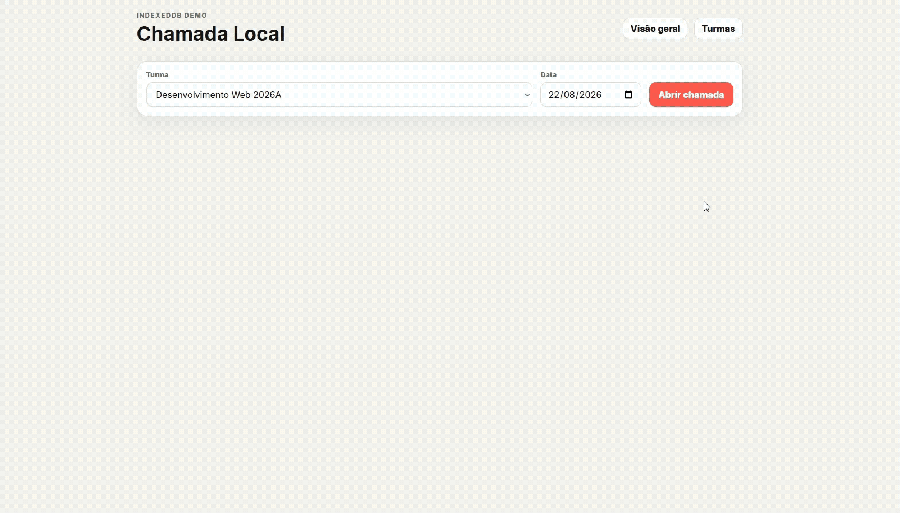

# Projeto: Remake de aplicação web simples



## Acesso

https://elc1090.github.io/project1-2026b-RPFacco/

## Desenvolvedor(a)
Nome: Ricardo Facco Pigatto<br>
Curso: Sistemas de Informação


## App original

### Links

- Acesso: https://elc1090.github.io/demo-attendance-indexeddb/
- Repositório: https://github.com/elc1090/demo-attendance-indexeddb

### Descrição

Protótipo client-side para demonstrar IndexedDB em uma aplicação de chamada.
#### Funcionalidades
- importação de turma por CSV;
- CSV com apenas duas colunas: `id` e `nome`;
- suporte a múltiplas turmas;
- criação/abertura de chamada por data;
- todos os estudantes começam como presentes; desmarcar o checkbox registra ausência;
- filtros por status;
- busca de estudante;
- persistência local com IndexedDB;
- exportação em CSV e JSON;
- layout responsivo para desktop e smartphone.
#### Tecnologias
- HTML
- CSS
- JavaScript
- IndexedDB
#### Autor
Andrea Schwertner Charão | [AndreaInfUFSM](https://github.com/AndreaInfUFSM)

## Demanda do(a) cliente

### Cliente
Arthur Moro Fróes

### Demanda

- Menu de visão geral das minhas chamadas, onde posso navegar pelas turmas e ver todas as chamadas realizadas em uma turma. Ao clicar em uma chamada, abrir na tela dela para edição. É ruim ter que navegar nas chamadas pelo calendário, selecionado os dias individuais
- Opção de exportar em PDF (com estética de acordo com o restante da aplicação) ao invés de CSV
- Opção de exportar todas as chamadas de uma turma. Adicionar em páginas dentro de um PDF cada chamada realizada, ordenado por data da mais antiga pra mais recente.
- Visão geral de presenças de uma turma usado gráficos fáceis de entender. Na mesma tela onde vemos todas as chamadas da turma.
- Opção de exportar o relatório de presença de um único aluno durante todo o semestre.


## Desenvolvimento

### Processo

#### Primeira demanda (Visão Geral)
Primeiro, decidi explorar como era feito o botão "Turmas" para poder colocar um botão de visão geral do lado. Tentei copiar e colar o `button` Turmas, mas na página os botões ficavam com um espaçamento muito grande um do outro, em vez de ficarem juntos lado a lado.<br>
Descobri que a classe css que os botões usavam faziam com que a distribuição de elementos em `header` ficassem igualmente espaçados, com `display: flex` e `justify-content: space-between`<br>

Para resolver, coloquei os dois `button` em uma div, então agora são tratados como um elemento só.
O meu próximo passo foi olhar como funcionava o botão de Turmas e como ele se ligava ao JavaScript. Notei que "id" fazia essa ligação, da seguinte maneira:<br>
tal id fica dentro de função no js `bindEvents` cuida de todos os clique e eventos --> quando é clicado, chama outra função (async?) que é onde está a lógica para mostrar as turmas.

Dessa forma, fiz a mesma coisa com o botão Visão Geral, aproveitando o código que Turmas utiliza. Após isso, precisei desenvolver a lógica de "clicar em turma -> mostrar todas as chamadas em lista, de acordo com id da turma e data", e para isso criei uma nova função para cuidar disso. Eu já entendia o que e como queria fazer, porém, o JavaScript é para mim uma linguagem nova, então precisei consultar IA para entender como "escrever em JS" meu objetivo.
Com isso, Visão Geral era funcional, apesar de não muito bonito.

#### Quarta demanda (Gráfico em Visão Geral)
Aqui, decidi primeiramente pesquisar por bibliotecas JavaScript que faziam a construção de gráficos para mim. Achei a Chart.js, e importei no HTML com `script`, e depois criei uma nova `div` em na seção de overview para colocar o `overviewCharts`. Dessa maneira, cada chart pode ser adicionado com um `canvas`.

`overviewCharts` sai de `hidden` quando uma turma é clicada, assim mostrando o gráfico construído na função `renderAttendanceChart`. Para essa construção, eu preciso dos status de faltas da turma selecionada, e isso é feito pela função `buildAttendanceStats` e então usado pela função de renderização do chart.

Por enquanto só há um gráfico, mas é possível adicionar mais. Quando terminei o primeiro grtáfico, decidi partir para a próxima demanda. Nessa demanda, aprendi sobre a biblioteca Chart.js e como construir gráficos com ela.

#### Segunda e Terceira demanda (Exportar em PDF)
Para a segunda e terceira demanda, comecei do mesmo jeito que na quarta: procurando uma biblioteca que fizesse o PDF por mim. As duas que me chamaram atenção foram `html2pdf` e `jsPDF`. A primeira resolveria a demanda estética, já que literalmente tira uma print da tela e coloca como imagem no pdf. Mas decidi não escolher essa opção, justamente porque o pdf seria só o conjunto de várias prints, sem texto selecionável.

A jsPDF tem um plugin que constrói tabelas, o jspdf-autotable, que facilitaria o trabalho. Importei as duas no HTML com script, igual fiz com a Chart.js. Percebi que a ordem importa, pois o jspdf-autotable procura o jsPDF já importado. Como o app já exportava CSV, aproveitei a função que existia. A `exportCsv` já montava um array rows com id, nome, data e status de cada aluno, e isso serve igual pro `autoTable`, que também quer um array de arrays

Para a terceira demanda, criei um botão novo na Visão geral, que aparece junto com o gráfico quando uma turma é clicada. O interessante no app é que o `IndexedDB` não guarda as presenças de fato, somente as faltas de cada aluno, então a presença é a ausência de registro.  Então, pra cada chamada, eu busco só as faltas e monto um `Set` com elas, se a chave do aluno não está no `Set`, ele estava presente.

#### Quinta demanda (PDF por aluno)
Como a Visão geral já tinha o botão de exportar a turma inteira, aproveitei a mesma div e coloquei um select com os alunos da turma ao lado dele. O select é preenchido quando uma turma é clicada.

Com o aluno selecionado, fui buscar as faltas dele. Aqui descobri que o store attendance tem um índice por `studentKey` que eu ainda não tinha usado nas outras demandas.  Na hora de montar a tabela percebi que não dava pra reaproveitar o `drawSession` da demanda anterior, pois tinha propósito bem diferente. Então criei uma função nova, a   
`drawStudentReport`.

### Trechos de código
#### 1. O objeto `el`

A primeira coisa que notei no JavaScript foi o `const el`:

```javascript
const $ = (id) => document.getElementById(id);

const el = {
    emptyState: $("emptyState"),
    dashboard: $("dashboard"),
    studentSelect: $("studentSelect"), ...
```

Isso serve para ter um lugar só que lista todos os elementos da página que o app usa, em vez de ter um monte de `document.getElementById` espalhado.

#### 2. Presença é a ausência de registro
```javascript
const absents = await getByIndex("attendance", "sessionId", session.id);
const absentKeys = new Set(absents.map(a => a.studentKey));

// e para cada aluno:
absentKeys.has(student.key) ? "absent" : "present"
```

Eu esperava que o banco tivesse um registro por aluno dizendo presente ou ausente, mas olhando o `setPresence` vi que marcar presente apaga o registro do IndexedDB. Então    
numa turma de 8 alunos com 2 faltas, o banco tem 2 registros, não 8.

#### 3. Quando a função precisa ser async
```javascript
function exportPdf() {
    const absentKeys = new Set(...);
    drawSession(doc, currentClass, currentSession, currentStudents, absentKeys);
}
async function exportStudentPdf(classId, studentKey) {
    const klass = await requestToPromise(tx("classes").get(classId));
    const sessions = await getByIndex("sessions", "classId", classId);
}
```

Foi um conceito novo para mim, mas era bem simples. No exemplo, a `exportPdf` usa o que já está carregado na memória, e a `exportStudentPdf` precisa buscar no IndexedDB, que demora.

O async serve pra poder usar o await dentro da função, e o await pausa só aquela função enquanto espera o dado chegar, deixando o resto da página respondendo normalmente.

## Tecnologias

### Linguagens e afins
- HTML
- CSS
- JavaScript
- IndexedDB
- Chart.js
- jsPDF
- jsPDF-AutoTable

### Ambiente de desenvolvimento
- IntelliJ IDEA
- Git e GitHub
- Claude Code - agente de IA, usado para entender como o código funciona e tirar dúvidas.

## Referências e créditos
- App original: demo-attendance-indexeddb, de Andrea Schwertner Charão (AndreaInfUFSM)
- Documentação do Chart.js
- Documentação do jsPDF e jsPDF-AutoTable
- Claude - usado para: entender trechos do código original; esclarecer conceitos de JavaScript; ajudar na tradução da minha intenção para a sintaxe da linguagem.


---
Projeto entregue para a disciplina de [Desenvolvimento de Software para a Web](http://github.com/andreainfufsm/elc1090-2026b) em 2026b